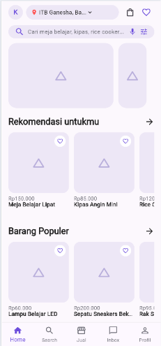
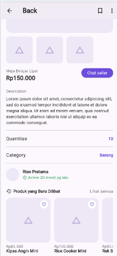
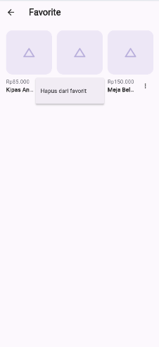

# Kosply

Aplikasi marketplace barang bekas untuk mahasiswa, dibuat dengan Flutter sebagai hasil slicing UI dari desain Figma proyek PBL UAS. Dikerjakan untuk **Tugas #6 – Mobile Developer**.

## Desain Figma

🔗 https://www.figma.com/design/TkunWRuVgaA6JapwO536j0/Untitled?node-id=1-2&t=V12IOuAJAjA3HEC7-1
## Screenshot

| Home | Product Detail | Favorite |
|------|----------------|----------|
|  |  |  |

## Fitur

- **Home**: header lokasi, search bar, banner, dan beberapa section produk (list horizontal).
- **Product Detail**: galeri gambar, judul, harga, tombol *Chat seller*, deskripsi, quantitas, kategori, info penjual, dan produk terkait.
- **Favorite**: daftar produk favorit dalam grid 3 kolom, dengan menu ⋮ untuk menghapus dari favorit.
- **Favorit lintas screen**: tap ikon hati di Home atau ikon bookmark di Detail, dan perubahannya langsung terlihat di semua screen.

## Teknologi

- Flutter (Dart)
- State management: **Provider** (`ChangeNotifier`)

## Widget Advanced yang Dipakai

- `CustomScrollView` + `SliverAppBar` + `SliverToBoxAdapter` (Home dan Product Detail)
- `GridView` (Favorite)
- `Stack` + `Positioned` (tombol hati di atas gambar pada `ProductCard`)
- `ListView.separated` horizontal (section produk dan thumbnail)

## Global State Management (Provider)

State favorit disimpan di `FavoriteProvider` (`lib/providers/favorite_provider.dart`) dan didaftarkan di root aplikasi melalui `MultiProvider`. Widget di setiap screen membaca dan mengubah state yang sama:

- `context.select` / `context.watch` untuk membaca status favorit agar UI otomatis rebuild.
- `context.read` untuk memanggil `toggleFavorite` tanpa memicu rebuild.

Dengan begitu, mengubah favorit di satu screen langsung tersinkron ke screen lain tanpa mengirim data manual antar halaman.

## Struktur Folder

```
lib/
├── main.dart          # entry point + MultiProvider
├── data/              # data dummy produk
├── models/            # model data (Product)
├── providers/         # state management (FavoriteProvider)
├── screens/           # halaman: Home, Product Detail, Favorite
├── theme/             # warna dan tema aplikasi
└── widgets/           # widget reusable (ProductCard, placeholder gambar)
```

UI (`screens/`, `widgets/`) dipisahkan dari logika/state (`providers/`) dan data (`models/`, `data/`).

## Cara Menjalankan

```bash
git clone <URL-REPO-KAMU>
cd kosply
flutter pub get
flutter run -d chrome
```

Prasyarat: Flutter SDK terpasang (cek dengan `flutter doctor`).

## Catatan

- Gambar produk masih berupa placeholder sesuai wireframe; data produk adalah data dummy.
- Menu Search, Jual, Inbox, dan Profil di bottom navigation belum diimplementasikan (di luar cakupan tugas ini).

## Pembuat

- **Nama**: Aditya Pratama Gunawan
- **NIM**: 253140701111013
- **Kelompok**: Kelompok 2